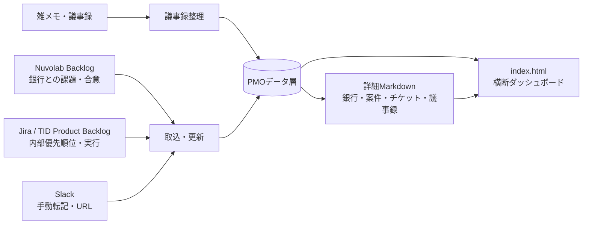
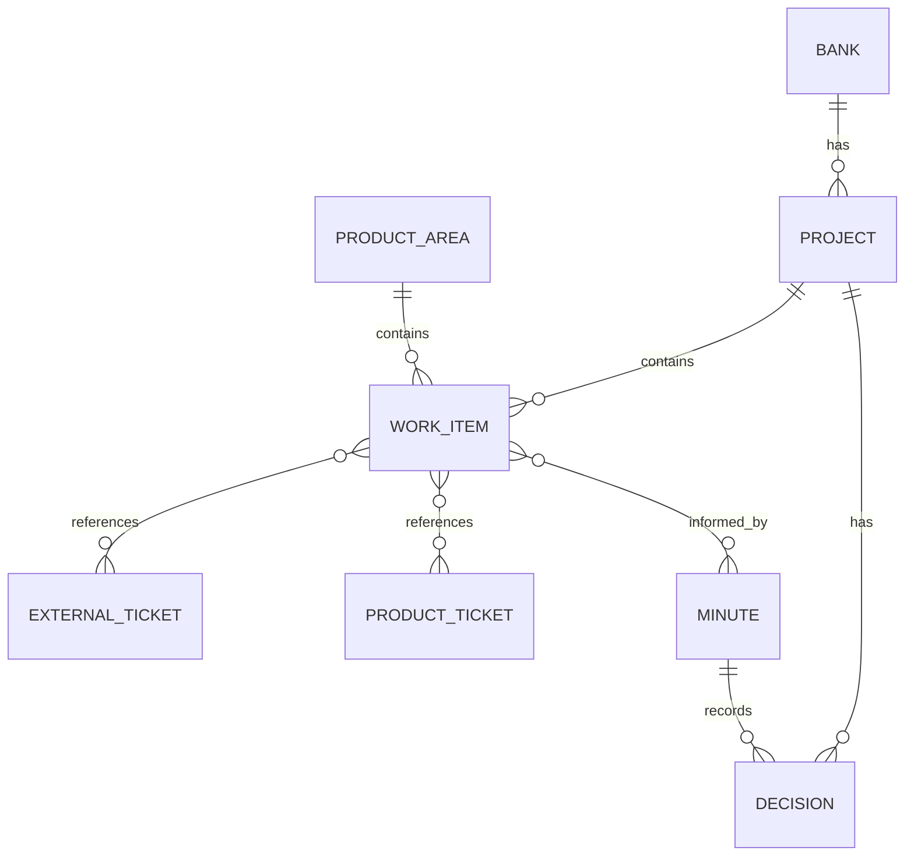

# TID PRD PMO基盤 設計案

- **作成日**: 2026-08-22
- **対象**: TID PRDが担当・監視する銀行案件、プロジェクトバックログ、プロダクトバックログ
- **目的**: プロジェクトの現在地、具体タスク、TID PRDの責務、担当ボール、外部とのやり取りを一つの画面と詳細ページで追跡できるようにする。

## 1. 解決したいこと

| 要求 | 管理する情報 | 完了条件 |
|---|---|---|
| 銀行タスクの継続更新 | 状態、期限、担当ボール、次アクション、更新日時 | 期限超過・本番影響・回答待ちが日次で見つかる |
| 雑メモのナレッジ化 | 決定事項、未決事項、依頼、根拠、関連チケット | 議事録からタスク・決定・リスクが分離され、検索できる |
| Backlogの目的と現在地の可視化 | 作成目的、経緯、最新状態、Backlog URL、関連成果物 | チケットを開かなくても何のための課題か判断でき、リンクから原本へ遷移できる |
| TID Product Backlogの管理 | プロジェクト対応 / プロダクト対応、親子関係、リリース、実行チーム | TID PRDが優先順位・仕様・リリース調整を担う対象を識別できる |
| PRD責務の判定 | 関与区分、理由、担当ボール | 「PRDが動く」「監視する」「対象外」が混ざらない |
| 横断ダッシュボード | 銀行、案件、タスク、リスク、リンク | 一覧から詳細ページへ1クリックで辿れる |

## 2. 設計原則

1. **外部システムの原本を上書きしない**: 銀行との合意・やり取りは Nuvolab Backlog、内部の実行・優先順位は Jira / Product Backlog を原本とする。
2. **ローカル基盤はPMO判断の正本にする**: 集約した担当ボール、PRD責務、次アクション、リスク、各原本へのリンクをこのリポジトリで管理する。
3. **事実と判断を分ける**: チケットの状態・期限・コメントは事実、優先度・PRD関与・リスク・次アクションはPMO判断として別フィールドに保持する。
4. **更新元を記録する**: 各更新に `source`、`source_updated_at`、`last_reviewed_at` を残し、古い情報と推測を区別する。
5. **Slackは手動取り込みを前提にする**: MCP連携できないため、Slack投稿・スレッド・議事メモを人が貼り付け、根拠リンクと取得日時を保存する。

## 3. 全体アーキテクチャ



### コンポーネントの責務

| 層 | 役割 | 保存先 | 更新方法 |
|---|---|---|---|
| 外部原本 | 銀行合意・内部実行・会話の原記録 | Backlog / Jira / Slack | 各ツール上で更新 |
| 取込・整形 | 外部情報を要約し、IDとURLを保持する | `knowledge/` と `data/` | MCPまたは手動転記 |
| PMOデータ層 | 横断ビュー用の正規化データ | `data/*.yaml` | PMOエージェントが根拠付きで更新 |
| 詳細ナレッジ | 経緯・判断・会議メモを人が読める形にする | `bank/`、`knowledge/` | テンプレートに沿って更新 |
| ダッシュボード | 今日見るべき状態を絞り込んで表示する | `index.html` | `data/` を読み込み、静的に表示 |

## 4. 情報モデル

### 4.1 管理単位と関係



| エンティティ | 意味 | 主な識別子 |
|---|---|---|
| 銀行 | 顧客・銀行単位 | `taiko`、`tomato` |
| 案件 | 銀行ごとのフェーズ、または個別大型プロジェクト | `taiko-ph2` |
| プロダクト領域 | 銀行横断のTID改善・保守リリース区分 | `tid-maintenance`、`authentication` |
| ワークアイテム | PMOが進捗を追う最小単位。外部・内部チケットを束ねる | `WI-TAIKO-001` |
| 外部チケット | 銀行とのBacklogチケット | `TAIKOBANK-520` |
| プロダクトチケット | TID Product Backlog / 実行チームのJiraチケット | Jiraキー |
| 議事録 | 雑メモを構造化した記録 | `2026-08-22-taiko-weekly` |
| 決定事項 | 合意済み仕様または運用判断 | `DEC-2026-...` |

### 4.2 ワークアイテムの必須項目

以下を、銀行案件・プロジェクト案件・プロダクト案件で共通に持つ。これがダッシュボードの1行になる。

| 項目 | 内容 | 例 |
|---|---|---|
| `id` | ローカル一意ID | `WI-TAIKO-PH2-001` |
| `title` | 判断できる短い課題名 | MIRO画面設計書のレビュー |
| `classification` | `project` / `product` | `project` |
| `bank_id` | 銀行案件なら銀行ID。横断なら空 | `taiko` |
| `project_id` | 所属案件。小規模保守なら保守リリース区分 | `taiko-ph2` |
| `product_area_id` | プロダクト対応の領域。案件対応では任意 | `authentication` |
| `status` | `not_started` / `in_progress` / `waiting` / `blocked` / `done` | `in_progress` |
| `ball_owner` | 次に動く組織または担当 | `TID PRD`、`銀行`、`Berserkers` |
| `prd_involvement` | `own` / `coordinate` / `watch` / `out_of_scope` | `own` |
| `prd_scope_reason` | 基本設計・仕様合意との関係 | 画面仕様のレビューと銀行合意が必要 |
| `due_date` | 期日。ない場合は `null` | `2026-08-19` |
| `priority` | `critical` / `high` / `medium` / `low` | `high` |
| `next_action` | 次に誰が何をするか | TID PRDがMIROへコメントを記載 |
| `risk` | 放置時の影響 | 基本設計が遅延する |
| `source_refs` | Backlog、Jira、Slack、成果物のURL・ID | `TAIKOBANK-520` |
| `detail_path` | ローカル詳細ページ | `knowledge/backlog/taiko/TAIKOBANK-520.md` |
| `last_reviewed_at` | PMOが最後に確認した日時 | `2026-08-22` |

### 4.3 PRD関与区分

| 値 | 表示 | 判断基準 | 例 |
|---|---|---|---|
| `own` | PRDが担当 | 要件・基本設計・仕様決定・銀行合意・優先順位を主導する | ヒアリングシート、画面レビュー、仕様確定 |
| `coordinate` | PRDが調整 | 複数チームや銀行間の認識合わせ・リリース調整を行う | 共通基盤変更の影響確認 |
| `watch` | PRDが監視 | 技術実施は他チームだが、顧客影響・回答状況を追う | 本番問い合わせの技術調査 |
| `out_of_scope` | PRD対象外 | 技術調査、環境準備、実装、テスト実施のみでPRD判断がない | テストデータの払い出し |

**原則**: TID PRDの主担当は基本設計まで。実装・テストは担当チームのボールとする。ただし、仕様未確定、顧客合意、優先順位、リリース判断が残る場合はPRDの `own` または `coordinate` を維持する。

## 5. ファイル構成案

既存の Markdown 資産を保持し、ダッシュボード向けに機械可読データを追加する。

```text
daily-task/
  index.html                         # 横断ダッシュボード
  data/
    banks.yaml                       # 銀行マスタ
    projects.yaml                    # 案件・リリース・現在地
    work-items.yaml                  # ダッシュボードの主データ
    integrations.yaml                # 外部システムのURLルール・最終同期日時
  bank/
    taiko/
      README.md                      # 銀行・案件の現在地（人間向け詳細）
      tasks.md                       # 銀行別の残タスク
      minutes/                       # 構造化済み議事録
        2026-08-22-weekly.md
  knowledge/
    backlog/                         # Backlogチケットの目的・経緯・現在地
    product-backlog/                 # Jira Product Backlogの要約・詳細
      projects/                      # 個別大型プロジェクト
      maintenance/                   # 銀行別の小規模保守リリース
      product/                       # 銀行横断のプロダクト改善
  templates/
    minute.md                        # 議事録テンプレート
    work-item.yaml                   # ワークアイテムテンプレート
  docs/
    pmo-platform-design.md           # 本設計書
```

### プロダクトバックログの分類ルール

| 区分 | 配置先 | 例 | 必須の紐付け |
|---|---|---|---|
| プロジェクトバックログ | `knowledge/product-backlog/projects/` | 大型の銀行導入、複数リリースを伴う案件 | 銀行、案件、リリース、Jiraキー |
| 銀行別保守リリース | `knowledge/product-backlog/maintenance/{銀行}/` | XX銀行の小規模改修・保守 | 銀行、リリース枠、Jiraキー |
| プロダクトバックログ | `knowledge/product-backlog/product/` | TID共通機能改善、SRE起因の改善 | 影響銀行、プロダクト領域、Jiraキー |

プロダクトバックログの一つのチケットが複数銀行へ影響する場合、チケットを複製せず、`affected_bank_ids` に複数の銀行IDを持たせる。

## 6. 更新フロー

### 6.1 日次: タスクと外部チケットの現在地更新

1. Nuvolab Backlogから新規・更新・期限超過・本番影響のチケットを取得する。
2. 既存の `knowledge/backlog/` に目的、最新コメントの要約、現在地、未決事項、Backlog URLを更新する。
3. 対応する `work-items.yaml` の状態、担当ボール、次アクション、最終確認日を更新する。
4. 期限超過、期限未設定の進行中、本番影響、ブロック中をダッシュボードの最上段へ出す。
5. 銀行別 `tasks.md` と横断 `task-all.md` は、ワークアイテムを人が確認しやすい形で要約する。

### 6.2 週次: TID Product Backlogの棚卸し

1. TIDスプリント計画前に、Jiraの新規・状態変更・リリース対象変更を確認する。
2. 各チケットを「プロジェクト」「銀行別保守」「プロダクト」に分類する。
3. PRD関与が `own` / `coordinate` なら、要件・基本設計・合意・優先順位・リリース判断の未完了点を明記する。
4. 実装・QA・SREボールなら、PRDの次アクションを「進捗確認」または「仕様回答」として分離する。
5. スプリント計画の決定を議事録とワークアイテムへ反映する。

### 6.3 随時: 雑メモから議事録・ナレッジを作る

1. ユーザーが雑メモ、Slack転記、会議メモを渡す。
2. PMOエージェントが事実を以下に分解する。
   - 決定事項
   - 未決事項
   - アクション（担当・期限・担当ボール）
   - リスク・依存関係
   - 関連Backlog / Jira / Slack / 成果物リンク
3. `bank/{銀行}/minutes/` または横断議事録として保存する。
4. 既存ワークアイテムの更新、新規ワークアイテム作成、または「要確認」としての保留を判断する。
5. チケット・仕様・成果物と矛盾する場合は、原文と差異を残し、事実未確認のままステータスを変更しない。

## 7. 画面設計: index.html

初期版は静的HTML + JavaScriptで実装し、サーバーや認証を追加しない。ローカルで `index.html` を開くだけで利用できる形にする。

### 画面構成

| 領域 | 表示内容 | 操作 |
|---|---|---|
| ヘッダー | 最終更新日、同期状態、未確認件数 | 更新対象の確認 |
| 要対応サマリー | 高優先度、期限超過、翌営業日期限、ブロック中、PRDボール | カードを押して一覧を絞り込む |
| フィルター | 銀行、案件、分類、状態、担当ボール、PRD関与、期限 | 複数条件で絞り込む |
| タスク一覧 | タイトル、現在地、期限、担当ボール、次アクション、リンク | 行またはリンクから詳細を開く |
| 案件一覧 | 工程、リリース予定、健康度、主要リスク | 案件詳細へ遷移 |
| プロダクト一覧 | プロダクト領域、影響銀行、リリース枠、PRD関与 | プロダクトバックログ詳細へ遷移 |
| 更新履歴 | 誰が何をいつ確認したか | 根拠を確認する |

### 詳細ページのリンク方針

- ダッシュボードのワークアイテムはローカルMarkdown詳細へリンクする。
- 詳細ページには、Nuvolab Backlog、Jira、Slack、Miro、成果物の外部リンクを並べる。
- 外部リンクはURLを隠さず、リンク名にチケットIDまたは成果物名を含める。
- 詳細に存在しない場合はリンクを生成しない。推測したURLは表示しない。

## 8. 初期導入の順序

### フェーズ1: 管理基盤の確立

1. `data/` のスキーマと、議事録・ワークアイテムのテンプレートを作る。
2. 既存の大光・トマト Backlog知見をワークアイテム化する。
3. 銀行別台帳と横断台帳の差異を洗い出す。
4. 雑メモを1件取り込み、議事録からタスク・決定事項へ展開する実運用を検証する。

### フェーズ2: Product Backlogの統合

1. TID Product Backlogの参照方法、Jiraキー、取得可能項目を確定する。
2. 現在のチケットを「プロジェクト」「銀行別保守」「プロダクト」に初期分類する。
3. 銀行Backlogとの関連、影響銀行、PRD関与を紐付ける。
4. 毎週水曜のスプリント計画後に更新する運用を定着させる。

### フェーズ3: ダッシュボード

1. `data/` を読み込む `index.html` を作る。
2. 要対応サマリー、フィルター、一覧、詳細リンクを実装する。
3. 大光・トマトで実データ検証を行う。
4. データ更新時に表示が壊れないチェックを追加する。

### フェーズ4: 取込の半自動化

1. 利用可能なBacklog / Jira MCPから取得できる項目と更新頻度を確認する。
2. 差分だけを取り込み、PMO判断が必要な項目は自動上書きしない。
3. Slackは貼り付け形式を統一し、手動転記でも根拠URLと日時を必須にする。

## 9. 初回セットアップで確定が必要な情報

以下は提示情報だけでは確定できないため、設計・実装開始時に入力または確認する。

| 確認事項 | 必要な理由 |
|---|---|
| TID Product BacklogのJiraプロジェクトキー、URL、閲覧権限、取得可能な項目 | Product Backlogとの正確な連携に必要 |
| 「XX銀行」保守リリースの銀行名・リリース枠・既存チケット一覧 | 銀行別保守と大型プロジェクトを正しく分類するため |
| Jiraチケットと実行チームチケットの親子・関連付けルール | 進捗の二重計上を防ぐため |
| ダッシュボード利用者と更新担当者 | 表示項目と編集権限を決めるため |
| Slackから手動転記する形式と保存対象チャンネル | 会話の証跡を一貫して残すため |

## 10. 成功判定

初期版は、次の5点を満たした時点で運用開始可能とする。

1. 大光・トマトのすべての未完了主要タスクに、担当ボール・次アクション・根拠リンク・最終確認日がある。
2. Backlogチケットの詳細から、作成目的、現在地、未決事項、Backlog URLへ辿れる。
3. TID Product Backlogの対象を3分類し、PRD関与を判定できる。
4. 雑メモ1件から、構造化議事録と少なくとも1件のワークアイテム更新を行える。
5. `index.html` で、高優先度・期限超過・PRDボール・案件別の一覧と詳細リンクを確認できる。